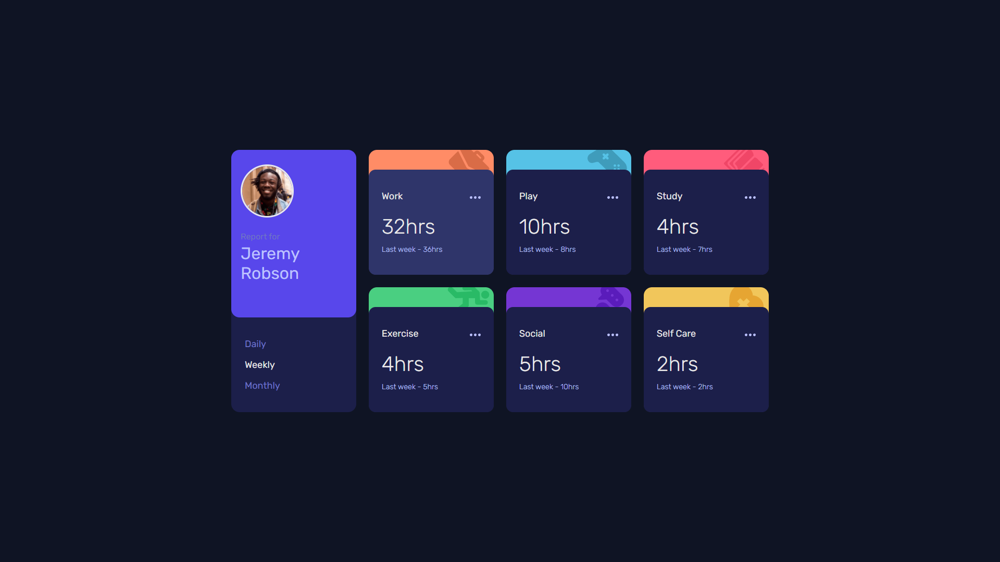

# Frontend Mentor - Time tracking dashboard solution

This is a solution to the [Time tracking dashboard challenge on Frontend Mentor](https://www.frontendmentor.io/challenges/time-tracking-dashboard-UIQ7167Jw). 

## Table of contents

- [Overview](#overview)
  - [The challenge](#the-challenge)
  - [Screenshot](#screenshot)
  - [Links](#links)
- [My process](#my-process)
  - [Built with](#built-with)
  - [What I learned](#what-i-learned)
  - [Continued development](#continued-development)
  - [Useful resources](#useful-resources)

## Overview

### The challenge

Your task is to build out the project to the designs inside the `/design` folder. You will find both a mobile and a desktop version of the design.

The designs are in JPG static format. Using JPGs will mean that you'll need to use your best judgment for styles such as `font-size`, `padding` and `margin`.

Users should be able to:

- View the optimal layout for the site depending on their device's screen size
- See hover states for all interactive elements on the page
- Switch between viewing Daily, Weekly, and Monthly stats

### Expected behaviour

- The text for the previous period's time should change based on the active timeframe. For Daily, it should read "Yesterday" e.g "Yesterday - 2hrs". For Weekly, it should read "Last Week" e.g. "Last Week - 32hrs". For monthly, it should read "Last Month" e.g. "Last Month - 19hrs".

### Screenshot

I've included 4 screenshots in the `/screenshots` folder: mobile, tablet, desktop, and fullscreen.

### Links

- [Solution URL](https://www.frontendmentor.io/solutions/mobilefirst-solution-using-vanilla-js-bem-flexbox-and-css-grid-83h8-Jx8S)
- [Live Site URL](https://victor-nyagudi.github.io/time-tracking-dashboard/)

## My process

I started with the HTML while observing the desktop design then wrote the CSS for the mobile version and
expanded from there. 

The JavaScript, as well as the tiny details, came last once I was done making the layouts.

### Built with

- Semantic HTML5 markup
- SCSS
- Flexbox
- CSS Grid
- Mobile-first workflow
- Vanilla JS

### What I learned

It felt good working with JSON data again and using the `fetch()` API as well as `async` and `await` to 
simulate what it would be like had I gotten this data from an external API.

I learned more about promises, writing my JavaScript in such a way that it's clean, readable, and 
follows the SOLID priniciples as much as possible, and organizing things so whatever I'm looking for is easy 
to find. 

I had to do some reading for this one just to brush up on a few concepts about making requests that weren't
exactly at my fingertips. 

Still, the whole process from start to finish was a good learning experience. 

### Continued development

I went over the 4 to 6 hour time limit I set by a couple of hours, finishing this challenge after about 9 hours.
Again, I have no regrets about this. I spent a good amount of time reading about requests, promises,
asynchronous JavaScript, and making API calls. 

The knowledge gained during this challenge is worth its weight in gold in that I now have a better grasp of 
working with JSON and hope to complete more projects covering this area. 

Either way, I hope to improve on this time once I get better.

I'm getting some good practice in when it comes to JavaScript, but I'd like to do more to get better at it e.g manipulating strings, array methods, OOP, DOM manipulation, etc. 

Every now and then, my mind thinks of things in terms of C#, so it would be good to know enough of both to be able to make the distinctions early on. 

All in all, I'm satisfied with the outcome. 

### Useful resources

- [join() method](https://developer.mozilla.org/en-US/docs/Web/JavaScript/Reference/Global_Objects/Array/join) - The JavaScript equivalent of `Concat()` method in C#. Great for joining strings in an array into one string using an optional separator.
- [split() method](https://developer.mozilla.org/en-US/docs/Web/JavaScript/Reference/Global_Objects/String/split) - This one's pretty much the same as its namesake in C#. Still, a useful method to know either way. 
- [includes() method](https://developer.mozilla.org/en-US/docs/Web/JavaScript/Reference/Global_Objects/String/includes) - The JavaScript equivalent of `Contains()`in C#. Another useful method worth noting. 

